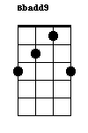
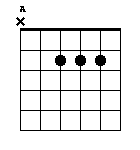
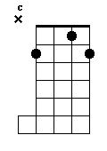

# ThatChord: A Python script for chord diagrams

**Created by Tom Conti-Leslie: [tomcontileslie.com](http://tomcontileslie.com).**

I am grateful for the helpful contributions of:

- Sophie Purkis Charters
- [@joshwd36](https://github.com/joshwd36)
- [Georg Wölflein](https://github.com/georgw777)
- [Reinis Cirpons](https://github.com/reiniscirpons)

**These files are distributed under a Creative Commons Share Alike license.**

[](https://creativecommons.org/licenses/by-sa/4.0/)

[](https://travis-ci.com/tomcontileslie/ThatChord)

## What is ThatChord?

That's exactly the question I ask myself a lot when I'm looking at a chord sheet for a song I'm learning, and the key it's in is bad
enough that some pretty obscure chord names are in there. This simple set of interdependent Python3 scripts allows you to copy
the name of an unknown chord into ThatChord, and have it output one or several diagrams which show you exactly how to play it.

My motivation to make this script came from the restricted capabilities of most currently available online chord tools, as well as a few idle hours
I once had on a plane with no internet. With ThatChord, your chosen instrument's number of strings and tuning, as well as your preferred output 
diagram format and preferences regarding muted strings and so on are *fully customisable*, with a number of presets available.

ThatChord supports a large list of chord qualities (see `dicts.py`), as well as chord alterations and bass notes - and, failing that, custom note-by note input. 
Strings such as `C`, `Fadd9` and `Bmin11(b5)/C` are all recognised and on guitar, produce delightfully simple plaintext diagrams such as:
```
   x
   ===========        x           
   | | | | O |      5 | | | O | O      8 O | | | | | 
   | | O | | |        | | | | | |        | | | O | O 
   | O | | | |        | | O | | |        | | | | | | 
   | | | | | |        | O | | O |        | | | | | | 
   | | | | | |        | | | | | |        | | | | | |  
```
ThatChord can also output equally simplistic, and also rather lightweight, PNG images:
| For ukulele                         |  For guitar                  | For banjo                    |
| :----------------------------------:|:----------------------------:|:----------------------------:|
|          |   |   |

These weigh a handful of kilobytes each at most.

## Installing and Using ThatChord

ThatChord runs by default via the Unix command line (though you can configure it to run via input
in the Python console if you prefer).
The default assumption is that the ThatChord folder lies in your Documents folder.
Install ThatChord there, or anywhere else, by cloning the repo:
```
cd ~/Documents
git clone https://github.com/tomcontileslie/ThatChord.git ThatChord
```
Also ensure you have Python3 installed, and you have the following modules:
- re
- os
- sys
- platform
- Pillow
- PyYAML

If you are missing any of the above modules, run:
```
python3 -m install module-name
```
Replacing `module-name` with the name of the module you need. re, os and sys should be available by default.

To run ThatChord, navigate to your ThatChord folder and run `thatchord.py` with your chord request as argument:
```
cd ~/Documents/ThatChord
python3 thatchord.py "Bbadd9(b5)/C:2"
```
In general, chord requests are structured as `WX(Y)/Z:T` where:
- `W` is a note, i.e. a letter `A-G` possibly followed by `b` or `#`
- (optional) `X` is a chord quality such as  `min7` or `11`. A large list of qualities are supported.
- (optional) `Y` is a list of one or more alterations which sharpen or flatten a given note in the chord.
  To sharpen the fifth, type `#5`. Concatenate the alterations to have several: `Cm7(b5b7)`.
- (optional) `Z` is a bass note. On guitar and banjo, ThatChord favours options where the bass note is
  played on the lowest non-muted string.
- (optional) `T` is a positive number. ThatChord returns the `T`th best option found. By default, `T` is set to 1
  (i.e. return the best option). If you are not satisfied with the diagram shown for `Cmin7`, for example, try
  running ThatChord again with `Cmin7:2` to see the next best option.
  
Since chords often contain special characters, you will most likely need to surround the chord request with
quotation marks, as in the example above.

Additionally, running:
```
python3 thatchord.py SETTINGS
```
will open your settings file so you can change the instrument ThatChord outputs diagrams for (default is ukulele).

For chords that don't have nice names, you can specify the notes making up the chord in a custom format. For example:
```
python3 thatchord.py "CUSTOM C Eb G"
```
will return a Cm chord. Make sure you add quotation marks so the notes are not interpreted as separate flags. That
being said, most separators work for custom input: `python3 thatchord.py CUSTOMC,Eb,G` requires no quotes.

For custom input, note that the order of notes is important. Enter the most important ones first, and for an instrument
like guitar or banjo you should either set the first note in the list to be the bass note, or choose a less bass-heavy
ranking preset than the guitar and banjo presets.

A number of flags can be specified when running ThatChord via the command line. Run:
```
python3 thatchord.py --help
```
for more information.

More information, including a step-by-step setup guide for beginners, is available
on the [ThatChord wiki](https://github.com/tomcontileslie/ThatChord/wiki).

## Contributing to ThatChord

I've made these files with experience mostly with ukulele, despite the fact that the algorithm scales to instruments like guitar.
This means that attempting to use it might make you notice issues. Please feel free to suggest any changes in the issues tab, or to
fork my repository and submit a pull request if you fix any bugs or have new features to suggest. Namely, the chord quality dictionary
(in `dicts.py`) is crucial to chord interpretation, and will never be complete - so any additions there are much appreciated!

On the programming side, I'm not the most efficient programmer and I remain blissfully unaware, I'm sure, of certain Python and GitHub conventions.
(my apologies in advance if you're using a linter on your Python files). You are most welcome to fork this repository to make changes which I would
be very happy to pull into the main project. Namely, if you would like to make these files more executable (rather than just a pile of
functions), then I would appreciate your help.

Please also have a look at the [issues page](https://github.com/tomcontileslie/ThatChord/issues) where some current needed improvements to the code
are listed. You have my gratitude if you decide to tackle one of them :)
